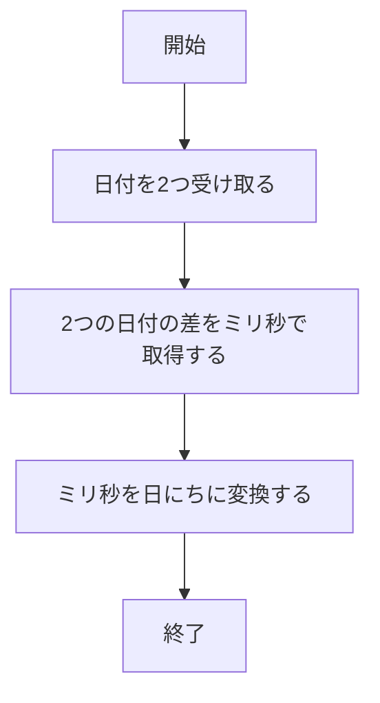
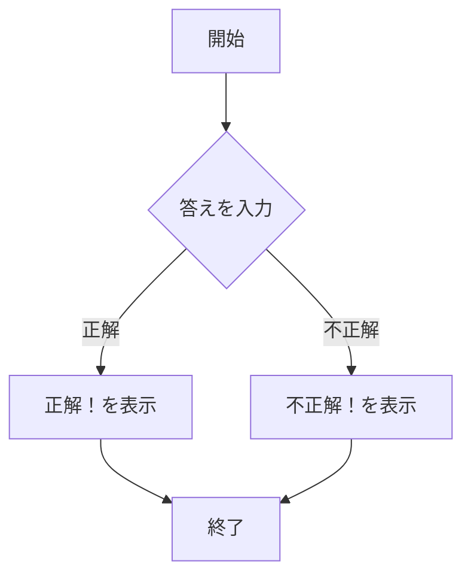
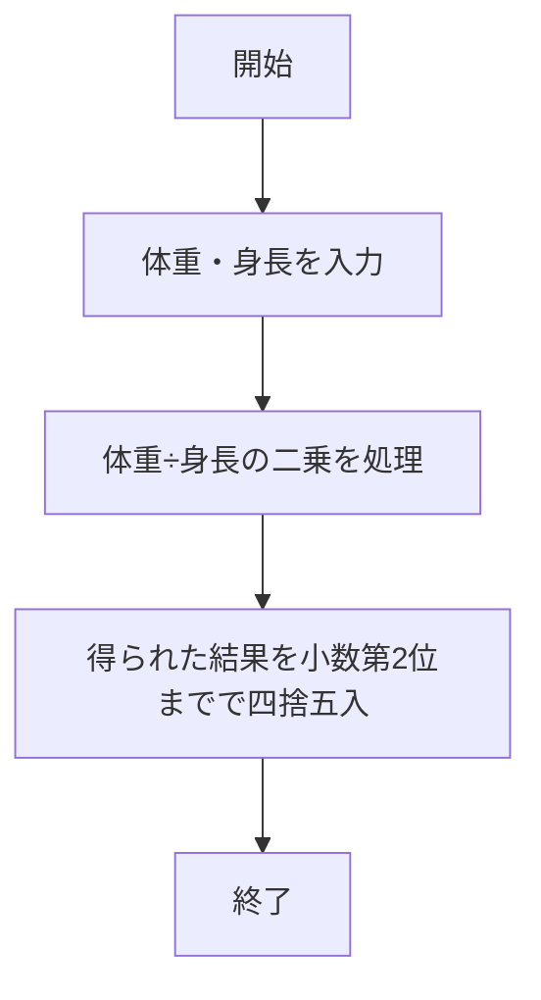

# webpro課題

## ファイル一覧

ファイル名 | 説明
-|-|
app5.js | プログラム本体
views/date.ejs | 日にち計算のテンプレートファイル
views/quiz.ejs | クイズのテンプレーファイル
views/bmi.ejs | BIM計算のテンプレートファイル

## 起動方法
1. app5.jsを下記コマンドによりローカルサーバーとして起動する．
```javascript
$ node app5.js
```
コマンド実行後に以下の表示が出れば正常にサーバーが起動している．
```javascript
Example app listening on port 8080!
```
2. ローカルでサーバーが起動したためブラウザからこのサーバーにアクセスすることができる．
URLは以下のようになる．
```URL
日にち計算
http://localhost:8080/date
クイズ
http://localhost:8080/quiz
BMI計算
http://localhost:8080/bmi
```

## gitでの管理方法
ここではgitでプログラムを管理するためのコマンドについて説明する．下記の順序に従い実行すれば更新をgitに反映することができる．

1. 現在のディレクトリ以下にある全ての変更を追加するコマンド
```comand
git add .
```
2. 変更にコメントをつけて保存するコマンド
```comand
git commit -am'ここにコメントを入れる'
```
3. gitに変更を反映させるコマンド
```comand
git push
```

## 機能の説明，使用するための手順など
### 日にち計算
#### 機能の説明

本プログラムでは，ある日付からある日付までが何日間であるかを計算する．

本プログラムのフローチャートは下記のものである．

#### 使用手順
1. app5.jsを起動する
2. Webブラウザでlocalhost:8080/public/dateにアクセスする
3. 計算したい日付を2つ選択
4. 計算ボタンを押し計算を実行する
5. 2つの日付の期間が表示される

以下プログラム本体
```javascript
app.get("/date", (req, res) => {
  let date1 = req.query.date1;
  let date2 = req.query.date2;
  let date10 = new Date(date1);
  let date20 = new Date(date2);
  let diffTime = date20 - date10;
  let diffDays = diffTime / (1000 * 60 * 60 * 24);

 
  res.render("date", {date1: date1, date2: date2, diffDays: diffDays});
});
```

### クイズ
#### 機能の説明
本プログラムでは, クイズを行える．正解の数字を入力すると，「正解！」，間違っていると「不正解！」が表示される．

本プログラムのフローチャートは下記のものである．


#### 使用手順
1. app5.jsを起動する
2. Webブラウザでlocalhost:8080/public/quizにアクセスする
3. クイズの答えを記入
4. 回答ボタンを押し正誤判定を実行する
5. 正解の場合は「正解！」を表示し，不正解の場合「不正解！」を表示

以下プログラム本体
```javascript
app.get("/quiz", (req, res) => {
  const correctAnswer = 3776;
  const inputAnswer = req.query.answer;
  if (!inputAnswer){
    return res.render("quiz", {
      message: null
    });
  }
  const isCorrect = inputAnswer ===String(correctAnswer);
  const message = isCorrect ? "正解！" : "不正解！";

  res.render("quiz", {message: message});
});
```

### BMI計算
#### 機能の説明
本プログラムでは，BMIの計算を行う子ができる．
体重と身長を入力することで，体重×$身長^2$を行いBMIを算出する．
本プログラムのフローチャートは以下のものである．



#### 使用手順
1. app5.jsを起動する
2. Webブラウザでlocalhost:8080/public/bmiにアクセスする
3. 体重・身長を入力
4. 計算ボタンを押し計算を実行する
5. 入力されたデータを基にBMIが表示される

以下プログラム本体
```javascript
app.get("/bmi", (req, res) => {
  const weight = parseFloat(req.query.weight);
  const height = parseFloat(req.query.height);
  const bmi = weight / ((height/100)*(height/100));
  const cutbmi = Math.round(bmi*100)/100;
  res.render("bmi", {bmi: cutbmi});
})
```