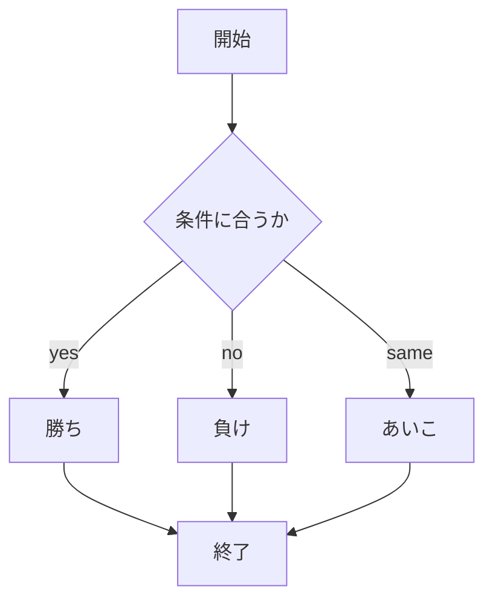

# webpro_06

##このプログラムについて

##ファイル一覧
ファイル名 | 説明
-|-|
app5.js | プログラム本体
public/janken.html | じゃんけんの開始画面
views/janken.ejs | じゃんけんのテンプレートファイル

1. app5.jsを起動する
2. Webブラウザでlocalhost:8080/public/janken.htlmにアクセスする
3. 自分の手を入力する




```javascript
app.get("/janken", (req, res) => {
  let hand = req.query.hand;
  let win = Number( req.query.win )||0;
  let total = Number( req.query.total )||0;;
  console.log( {hand, win, total});
  const num = Math.floor( Math.random() * 3 + 1 );
  let cpu = '';
  if( num==1 ) cpu = 'グー';
  else if( num==2 ) cpu = 'チョキ';
  else cpu = 'パー';
  let judgement = '';
  if(hand==cpu){
    judgement='あいこ';
  }
  else if((hand=='グー'&&cpu=='チョキ')||
          (hand=='チョキ'&&cpu=='パー')||
          (hand=='パー'&&cpu=='グー')
        ){
          judgement='勝ち';
          win += 1;
  }
  else {
    judgement='負け';
  }
 
  total += 1;
  const display = {
    your: hand,
    cpu: cpu,
    judgement: judgement,
    win: win,
    total: total
  }
  res.render( 'janken', display );
});

```